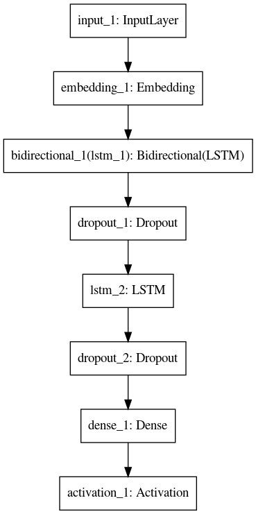
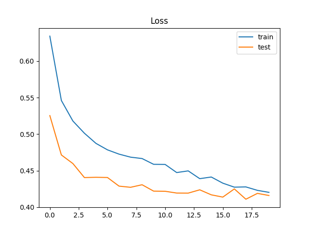
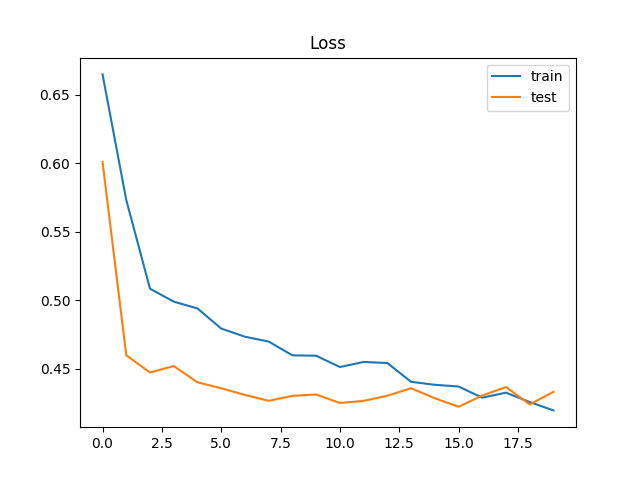

# Text-Classifier
## A text classifier using recurrent neural networks.
This is a text calssifier for classifying tweets into 2 categories(about a disaster or not). The program uses pretrained GloVe embeddings which can be downloaded from [here](http://nlp.stanford.edu/data/glove.6B.zip). For the purpose of this task what worked best was the 50 dimensional embeddings trained on a corpus of 6 billion textual data. Download the embeddings and place it in folder named Glove in the same repository. Install the dependencies by running `pip install -r requirements.txt`. Here I have added two models- LSTM and GRU. The GRU model seems to be having a stable accuarcy (i.e. not much fluctuations are observed in the valiadtion accuarcy over the epochs). Either of the models can be run by passing lstm or gru as argument in the commandline (`python main.py lstm` or `python main.py gru`). The *validation accuracy* should range between *80% to 82%* after 20 epochs of training in both the cases.

#### Model Architecture(LSTM)

#### Loss vs Epochs(LSTM)

#### Model Architecture(GRU)

#### Loss vs Epochs(GRU)

###### The dataset used is downloaded from [here](https://www.kaggle.com/c/nlp-getting-started).