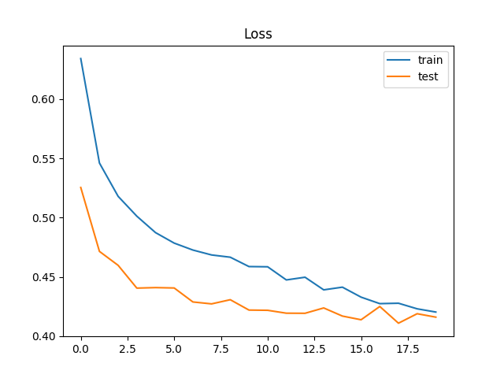
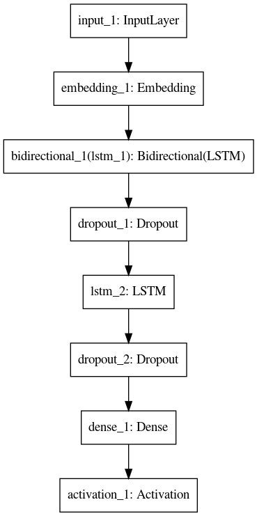

# Text-Classifier
## A text classifier using stacked LSTM model.
This is a text calssifier for classifying tweets into 2 categories(about a disaster or not). The program uses pretrained GloVe embeddings which can be downloaded from [here](http://nlp.stanford.edu/data/glove.6B.zip). For the purpose of this task what worked best was the 50 dimensional embeddings trained on a corpus of 6 billion textual data. Download the embeddings and place it in folder named Glove in the same repository. Install the dependencies by running `pip install -r requirements.txt`. Next run the script using `python main.py`. The *validation accuracy* should range between *80% to 82%*.

The model architecture is as follows:

The following is the plot of training and valiidation loss against number of epochs.
#### Loss vs Epochs

###### The dataset used is downloaded from [here](https://www.kaggle.com/c/nlp-getting-started).